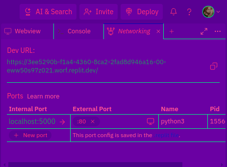

# Google Q&A Scraper

Google Q&A Scraper is a Flask web application designed to scrape Google's question and answer boxes for a given query. It provides users with a simple interface to input their questions and retrieves relevant answers from Google's search results. This tool can be particularly useful for platforms like Quizlet and Brainly.

## If You Find It Useful, Please Consider Giving It a Star ⭐

## Features

- **Scraping Q&A Boxes:** Extracts questions and answers from Google's question and answer boxes for a given query.

- **Customization:** Allows users to customize the tool by modifying the blacklist and whitelist to include or exclude specific domains from the search results.

## Getting Started

### Prerequisites

To run Google Q&A Scraper, you need the following dependencies:

- Python 3.x
- Flask
- BeautifulSoup
- requests

### Installation

1. Clone the repository:

    ```bash
    git clone https://github.com/Wuhpondiscord/Google-Q-A-Scraper.git
    ```

2. Install dependencies:

    ```bash
    pip install -r requirements.txt
    ```

## Usage

To use the application locally, follow these steps:

1. Navigate to the project directory:

    ```bash
    cd google-qna-scraper
    ```

2. Run the application:

    ```bash
    python app.py
    ```

## Deployment on Replit

To deploy the application on Replit, follow these steps:

1. Visit [Replit](https://replit.com/) and create or log in to your account.

2. Create a new Python REPL.

3. Copy the contents of `app.py` into the `main.py` file in your Replit project.

4. Your project files should look something like this:

    

5. Open the networking section in the top right corner:

    

6. Set the external port to `80`.

7. Press the "run" button.

8. Retrieve the URL to the site from the networking section.

## Customization

- **Blacklist and Whitelist:** You can customize the tool by modifying the `blacklist.txt` and `whitelist.txt` files to include or exclude specific domains from the search results.

## Contribution

Contributions are welcome! Please feel free to submit pull requests or open issues for feature requests, bug fixes, or general improvements.
